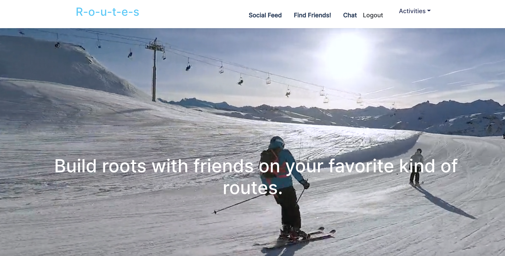

# Routes :ski: :bike: :walking:

  ### By bridgetvon, PlainDemon, brotherson67 * [Email us](bridget.schaefer31@gmail.com) * 

  ## Table of contents 📚
  * [Description](#Description)
  * [User Story](#User-story) 
  * [Installation Instructions](#installation-Instructions)
  * [Contributing](#Contributing)

  # Visual :eyes:
  
 
 
  # Description
   A social media website based around making friends and doing your favorite outdoor activities. Users can make friends, post about recent activities they've done, view national parks and sign in through strava to check their own stats.

  ## User Story :book:
  ```
  AS an outdoor enthusiast
  I WANT to meet people to do my favorite activities with 
  SO THAT I have more opportunities to meet up with friends and do my favorite things with

  ```

  ## Installation Instructions :hammer_and_wrench:
  No installation, simply navigate to the deployed application

  ## Deployed 
   https://glowing-sporky-routes.herokuapp.com/

  ## License :credit_card:
  * License Type: N/A


 ## Contributing 
 * Bridget Schaefer [Click to view Bridget's GitHub Profile!](https://github.com/bridgetvon) :skier:
 * Benjamin Chaplin [Click to view Bens GitHub Profile!](https://github.com/Plaindemon) 
 * Mitch Brotherson [Click to view Mitch's GitHub Profile!](https://github.com/brotherson67) 
    
  


